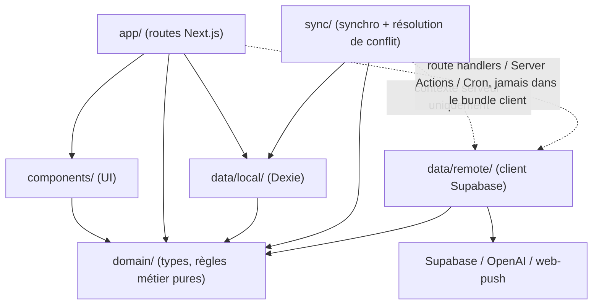
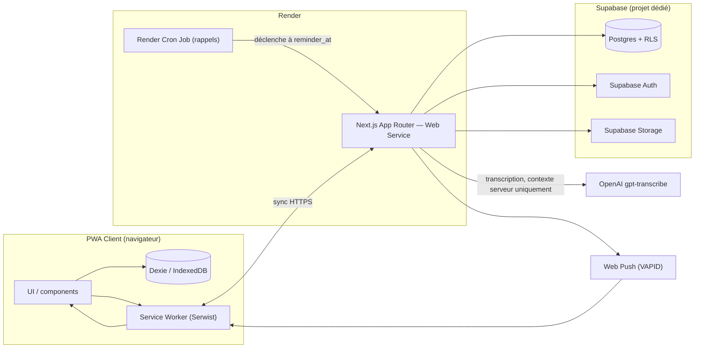
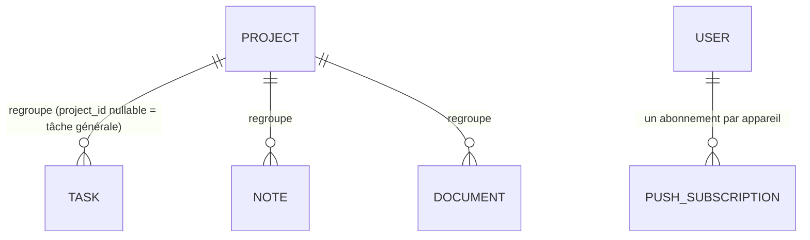

# Architecture Spine — Application de gestion de projets personnelle

## Design Paradigm

**Local-First.** Dexie/IndexedDB est la source de vérité immédiate pour toute écriture côté client ; un moteur de synchronisation dédié (`sync/`) pousse ensuite ces écritures vers Supabase en arrière-plan, dès que le réseau est disponible. Aucune écriture directe vers Supabase depuis l'UI : tout passe par le stockage local d'abord. Ce paradigme se projette sur l'arborescence comme suit :

- `domain/` — règles métier pures (entités, validations, cas d'usage) ; ne dépend d'aucune autre couche du projet.
- `data/local/` — implémentation Dexie, dépend de `domain/` (types des entités) ; lue/écrite en premier par toute opération utilisateur.
- `sync/` — moteur de synchronisation et résolution de conflit ; dépend de `domain/` et `data/local/`, et est le seul module autorisé à dépendre aussi de `data/remote/`.
- `data/remote/` — client Supabase, dépend de `domain/` (types) ; invoqué uniquement en contexte serveur.
- `app/` — routes Next.js (pages client + route handlers serveur), dépend de `domain/` et `components/`.
- `components/` — UI, ne dépend que de `domain/`.

## Invariants & Rules

### AD-1 — Local-first : aucune écriture client directe vers Supabase

- **Binds:** all
- **Prevents:** une écriture UI qui contourne la file locale et échoue silencieusement hors ligne ; une source de vérité ambiguë entre Dexie et Supabase.
- **Rule:** Toute création/modification initiée par l'utilisateur écrit d'abord dans Dexie (`data/local/`). Aucun composant ni route client n'appelle le client Supabase pour une écriture de données métier. Seul `sync/` fait transiter ces écritures vers `data/remote/`.

### AD-2 — Direction de dépendance entre couches

- **Binds:** all
- **Prevents:** un composant UI, une route, ou un Server Component/Server Action qui appelle `data/remote/` directement en contournant `sync/` ; une dépendance circulaire entre `domain/` et le reste ; deux implémentations d'une même page qui divergent selon qu'elles lisent via `domain/`→Dexie ou via un import direct de `data/remote/`.
- **Rule:** `domain/` ne dépend d'aucun autre module du projet (ni `data/*`, ni `sync/`, ni `app/`, ni `components/`) — il expose des types et des interfaces, jamais l'inverse. `data/local/`, `data/remote/` et `sync/` dépendent de `domain/`, jamais l'inverse. `sync/` est le seul module autorisé à dépendre à la fois de `data/local/` et `data/remote/`. `components/` ne dépend que de `domain/` ; `app/` dépend de `domain/`, `components/`, et `data/local/` (seule dépendance directe à une implémentation de stockage autorisée pour `app/`, puisque `data/local/` est toujours disponible même hors ligne). **`data/remote/` ne peut être importé — directement ou transitivement — que par du code qui ne s'exécute jamais dans le bundle client : route handlers, Server Actions, et Render Cron.** Un React Server Component qui importe `data/remote/` viole cette règle au même titre qu'un composant client : la distinction qui compte est "peut finir dans le bundle client", pas "où le fichier vit dans `app/`".



### AD-3 — Résolution de conflit au niveau du champ, jamais silencieuse

- **Binds:** FR-13, FR-14, FR-17, sync/, tout champ éditable après création sur les trois types capturables (Task.status, priority partagée Task/Note/Document, Note.transcription)
- **Prevents:** un écrasement silencieux d'une modification concurrente ; un faux conflit déclaré quand deux appareils modifient des champs différents de la même fiche hors ligne ; deux implémentations de `sync/` qui détectent un "conflit" différemment (l'une par simple comparaison d'horodatage, l'autre par comparaison à un point de synchronisation connu) et divergent sur les mêmes données.
- **Rule:** Chaque champ modifiable après capture porte sa propre métadonnée `<nom_du_champ>_updated_at`, **et** chaque enregistrement local porte, par champ, la valeur `<nom_du_champ>_synced_at` : l'horodatage du champ tel qu'il était lors de la dernière synchronisation réussie avec le serveur (le point de référence commun, pas juste "le plus récent gagne"). À la synchronisation d'un champ donné : si seul le local a changé depuis `<champ>_synced_at` → push. Si seul le distant a changé → pull. Si les deux ont changé depuis `<champ>_synced_at` → **conflit réel**, jamais résolu par simple comparaison d'horodatage entre les deux valeurs. Deux appareils modifiant des champs différents de la même fiche fusionnent toujours sans conflit (chaque champ est comparé indépendamment). Un vrai conflit bascule l'élément dans un état visible "conflit de synchronisation — à vérifier" (cf. `EXPERIENCE.md`) ; les deux valeurs sont conservées jusqu'à arbitrage manuel par l'utilisateur sur la fiche, qui fixe la valeur finale et met à jour `<champ>_synced_at`. Aucun écrasement automatique, jamais. Cas particulier suppression (Document, FR-21) : une suppression concurrente à une modification de champ (ex. priorité changée sur un appareil, document supprimé sur l'autre) est aussi traitée comme un conflit réel — jamais une suppression silencieuse d'une modification que l'utilisateur vient de faire.

### AD-4 — RLS sur chaque table, y compris mono-utilisateur

- **Binds:** all, data/remote/, schéma Supabase
- **Prevents:** une confiance implicite dans le code client pour restreindre l'accès aux données ; une exposition de documents sensibles via la clé anonyme.
- **Rule:** Chaque table Supabase active Row Level Security avec une policy explicite restreignant l'accès au propriétaire (`auth.uid()`), y compris en mono-utilisateur. Aucune table n'est créée ou déployée sans policy RLS associée.

### AD-5 — Stockage hors ligne des fichiers via Dexie + stockage persistant

- **Binds:** FR-16, FR-18, data/local/
- **Prevents:** la perte d'un blob (audio, document) avant upload suite à une éviction du stockage navigateur, notamment sur iOS ; un upload interrompu qui repart de zéro ; un fichier surdimensionné qui bloque silencieusement la synchronisation.
- **Rule:** Les blobs (audio de note vocale, fichiers document) sont stockés directement dans Dexie jusqu'à upload réussi vers Supabase Storage par `sync/`. L'application appelle `navigator.storage.persist()` au démarrage pour réduire le risque d'éviction. Taille maximale : 20 Mo par fichier (document ou audio), vérifiée à la capture. Un upload interrompu par une coupure réseau reprend depuis le dernier point réussi plutôt que de repartir de zéro.

### AD-6 — Le code serveur seul appelle Supabase/OpenAI/web-push directement

- **Binds:** FR-17, FR-36, FR-38, data/remote/
- **Prevents:** l'exposition de clés secrètes (clé de service Supabase, clé API OpenAI, clé privée VAPID) dans le bundle client ; un appel de transcription ou d'envoi push non fiable en contexte hors ligne.
- **Rule:** Les appels à l'API OpenAI (transcription), à web-push (envoi de notification), et à Supabase au-delà de la session Auth cliente (clé anonyme) ne s'exécutent que dans du code serveur (route handlers Next.js, Render Cron Job). Ces clés ne sont jamais injectées dans un composant client ni dans `components/`.

### AD-7 — Hébergement Render (Web Service + Cron), Vercel abandonné

- **Binds:** infrastructure de déploiement, FR-36
- **Prevents:** un retour à Vercel ou une divergence entre l'environnement de déploiement de l'app et celui du déclencheur de rappels.
- **Rule:** L'application Next.js est déployée en tant que Web Service Render (support App Router complet : route handlers, server actions, middleware). Les rappels de tâches (`reminder_at`) sont déclenchés par un Render Cron Job appelant un route handler serveur protégé, qui envoie la notification push. Vercel n'est plus une cible de déploiement.

### AD-8 — Choix technique de base [ADOPTED]

- **Binds:** all
- **Prevents:** l'introduction d'une stack alternative non alignée avec la spec technique initiale.
- **Rule:** Frontend en Next.js App Router ; stockage local hors ligne via Dexie/IndexedDB ; backend Supabase (Postgres + Auth + Storage), projet dédié, séparé de toute autre infra, avec deux buckets Storage distincts (`documents`, `audio`) ; PWA/service worker via Serwist ; notifications via Web Push API (VAPID). Ces choix proviennent de la spec technique initiale et ne sont pas rouverts par cette architecture. Exception révisée en session (cf. AD-7 pour l'hébergement) : la transcription utilise `gpt-transcribe` et non `whisper-1`, ce dernier étant dé-priorisé par OpenAI — la spec technique source a été corrigée en conséquence.

### AD-9 — Authentification mono-utilisateur email/mot de passe [ADOPTED]

- **Binds:** FR-39, AD-4
- **Prevents:** l'introduction d'un lien magique ou d'une gestion de rôles/permissions non prévue.
- **Rule:** Un seul compte utilisateur existe. Authentification par email + mot de passe via Supabase Auth. Aucun lien magique. Aucune architecture de rôles/permissions à prévoir.

### AD-10 — Abonnements push par appareil, ré-enregistrement silencieux

- **Binds:** FR-36, FR-37, FR-38, data/remote/, ERD
- **Prevents:** un seul abonnement push partagé qui écraserait celui d'un autre appareil ; une notification qui cesse silencieusement de fonctionner après expiration du token, notamment sur iOS (risque déjà identifié dans la spec technique initiale, §3).
- **Rule:** Chaque appareil enregistre son propre abonnement push dans une entité `PushSubscription` (rattachée à l'utilisateur, une ligne par appareil/navigateur). Le service worker ré-enregistre l'abonnement silencieusement (sans action utilisateur) à chaque activation ou changement détecté, et `sync/` met à jour l'entité correspondante côté serveur. Un abonnement expiré ou invalide est remplacé, jamais laissé à échouer silencieusement lors de l'envoi.

## Consistency Conventions

| Concern | Convention |
| --- | --- |
| Naming (entities, files, interfaces, events) | Entités du domaine en anglais (`Project`, `Task`, `Note`, `Document`), identiques en code et en schéma. Enums en anglais/snake_case côté code et DB (`status`: `todo` \| `in_progress` \| `done` ; `priority`: `low` \| `normal` \| `high`), traduits uniquement à l'affichage (À faire/En cours/Terminé ; Basse/Normale/Haute). Composants React en PascalCase, modules en camelCase/kebab-case selon convention Next.js standard. |
| Data & formats (ids, dates, error shapes, envelopes) | Ids d'entité en `uuid` v4, générés côté client à la création (permet l'écriture hors ligne sans id serveur). Horodatages en ISO 8601 UTC en stockage (Dexie et Postgres), conversion en fuseau local à l'affichage uniquement. Erreurs sous forme uniforme `{ code, message, field? }` propagée de `sync/` vers l'UI. Enveloppe de file de synchronisation, une entrée par (entité, champ) en attente — **clé d'idempotence = `entity_id + field`, jamais un id généré par tentative** (un même champ en attente n'a qu'une seule entrée de file ; une nouvelle modification avant sync met à jour l'entrée existante plutôt que d'en empiler une autre) : `{ id: entity_id + ':' + field, entity: 'task'\|'note'\|'document'\|'project', entity_id: uuid, field: string, operation: 'create'\|'update'\|'delete', value: any \| null, updated_at: ISO8601, synced_at: ISO8601 \| null, device_id: string, status: 'pending'\|'syncing'\|'synced'\|'conflict'\|'error' }`. `create` porte la valeur initiale de chaque champ (une entrée par champ, pas un instantané unique) ; `update` porte uniquement le champ modifié (delta, jamais l'enregistrement entier) ; `delete` porte `field: '__record__'`, `value: null` — l'entrée de suppression prime sur toute entrée `pending` restante pour le même `entity_id` (cf. AD-3 pour l'arbitrage suppression vs modification concurrente). |
| State & cross-cutting (mutation, errors, logging, config, auth) | Toute mutation transite par `domain/` — jamais un composant qui écrit directement dans Dexie ou appelle `sync/` en le contournant. UI entièrement en français (vouvoiement, cf. `EXPERIENCE.md`) ; code, schéma et commentaires en anglais. Session Supabase Auth (clé anonyme) seule exposée côté client ; clé de service Supabase, clé API OpenAI, clé privée VAPID uniquement en variables d'environnement serveur (cf. AD-6). Pas de tracking d'usage/business (cf. PRD Non-Goals) ; logging technique serveur limité aux erreurs de synchronisation et d'appels API externes. |

## Stack

| Name | Version |
| --- | --- |
| Next.js (App Router, React 19.2) | 16.3.0 |
| Serwist (`@serwist/next`) | 9.5.11 |
| Dexie.js | 4.4.4 |
| `@supabase/supabase-js` | 2.112.0 |
| web-push (Node, VAPID) | 3.6.7 |
| OpenAI — transcription | `gpt-transcribe` (remplace `whisper-1`, dé-priorisé par OpenAI au profit de ce nouveau modèle) |
| TypeScript | 7.0.2 |
| Render | Web Service (app) + Cron Job (rappels) — plateforme managée, pas de version applicative |

## Structural Seed

### Vue système / conteneurs



### Déploiement & environnements

| Élément | Détail |
| --- | --- |
| Application | Render Web Service (production), Next.js App Router complet (route handlers, server actions, middleware). |
| Rappels | Render Cron Job appelant un route handler serveur protégé à l'heure de chaque `reminder_at`. |
| Backend | Projet Supabase dédié — non partagé avec une autre infra existante (Postgres + Auth + Storage). |
| Variables d'environnement | `NEXT_PUBLIC_SUPABASE_URL`, `NEXT_PUBLIC_SUPABASE_ANON_KEY` (client) ; `SUPABASE_SERVICE_ROLE_KEY`, `OPENAI_API_KEY`, `VAPID_PUBLIC_KEY`, `VAPID_PRIVATE_KEY`, `VAPID_SUBJECT` (serveur uniquement). |
| Environnement de staging | Aucun — décision explicite, non nécessaire pour un outil interne solo. |

### Modèle d'entités (ERD)



`Task`, `Note`, `Document` (les trois types capturables, cf. FR-3) portent chacun `priority` (Basse/Normale/Haute), `provenance` (téléphone/ordinateur) et `is_new` (badge "nouveau", cf. FR-24/FR-25). `Project` n'a pas ces champs — il porte `color`, `status` (actif/archivé). `Task.status`, la `priority` (partagée Task/Note/Document), et `Note.transcription` sont des champs éditables après création : chacun porte sa métadonnée `<nom_du_champ>_updated_at` (ex. `status_updated_at`, `priority_updated_at`) dédiée pour la résolution de conflit au niveau du champ (cf. AD-3). Le détail exact des colonnes est laissé au code (cf. Deferred).

### Arborescence minimale

```text
/
  app/          # routes Next.js App Router — pages client + route handlers serveur
  domain/       # règles métier pures, aucune dépendance IO
  data/
    local/      # Dexie / IndexedDB — source de vérité immédiate
    remote/     # client Supabase — importé uniquement en contexte serveur
  sync/         # moteur de synchronisation + résolution de conflit par champ
  components/   # UI partagée
```

## Capability → Architecture Map

| Capability / Area | Lives in | Governed by |
| --- | --- | --- |
| 4.1 Capture ("+") — FR-1 à FR-5 | `components/` (stepper Projet → Priorité → Type), `domain/` (validation du flux), `data/local/` (écriture Dexie immédiate) | AD-1, AD-5 |
| 4.2 Gestion des projets — FR-6 à FR-9 | `domain/` (règles d'archivage), `data/local/`, `sync/` | AD-1, AD-3 |
| 4.3 Tâches — FR-10 à FR-14 | `domain/` (statut, priorité), `sync/` (conflit par champ sur status/priority) | AD-3 |
| 4.4 Notes — FR-15 à FR-17 | `data/local/` (blob audio), `app/` route handler (transcription serveur) | AD-5, AD-6, AD-3 |
| 4.5 Documents — FR-18 à FR-21 | `data/local/` (blob), `sync/` (upload vers Supabase Storage) | AD-3 (conflit sur `priority`), AD-5, AD-6 |
| 4.6 Vue projet — FR-22 à FR-26 | `components/` (onglets, filtres, badges), `domain/` (tri combinable, statut "nouveau") | AD-3 (badge "nouveau"), Conventions (naming) |
| 4.7 Calendrier général — FR-27 à FR-32 | `components/` (vue mois/semaine), `domain/` (agrégation en lecture des tâches à échéance) | Design Paradigm |
| 4.8 Offline & synchronisation — FR-33 à FR-35 | `sync/`, `data/local/`, `data/remote/` | AD-1, AD-2, AD-3 |
| 4.9 Notifications push — FR-36 à FR-38 | `app/` route handlers serveur, Render Cron Job | AD-6, AD-7, AD-10 |
| 4.10 Authentification — FR-39 | `app/` (session Supabase Auth), `data/remote/` (RLS) | AD-4, AD-9 |

## Deferred

- **Schéma exact Dexie/IndexedDB** (tables, index) — job du code une fois l'implémentation démarrée, non figé par la spine.
- **Définitions exactes des tables/colonnes Supabase** (migrations SQL) — job du code ; la spine ne fixe que les noms d'entités et relations (cf. ERD).
- **Supervision applicative et sauvegarde** — pas d'outil de monitoring/alerting dédié ni de plan de sauvegarde/restauration explicite au-delà de ce que Render (logs) et Supabase (sauvegardes automatiques du plan retenu) fournissent nativement. Jugé suffisant pour un outil interne solo ; à revisiter si l'usage ou la criticité perçue grandit.
- **Palier exact du plan Supabase Storage** — le plafond de 20 Mo/fichier (AD-5) est fixé ; le choix du palier tarifaire Supabase Storage qui l'accueille reste un détail d'implémentation, pas une décision d'architecture.
